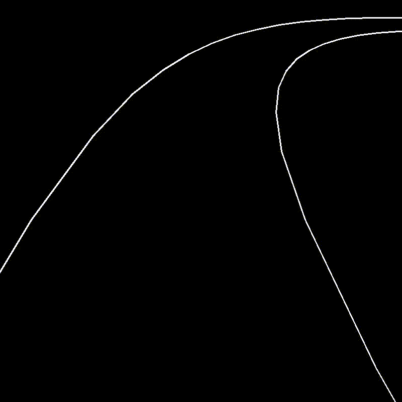
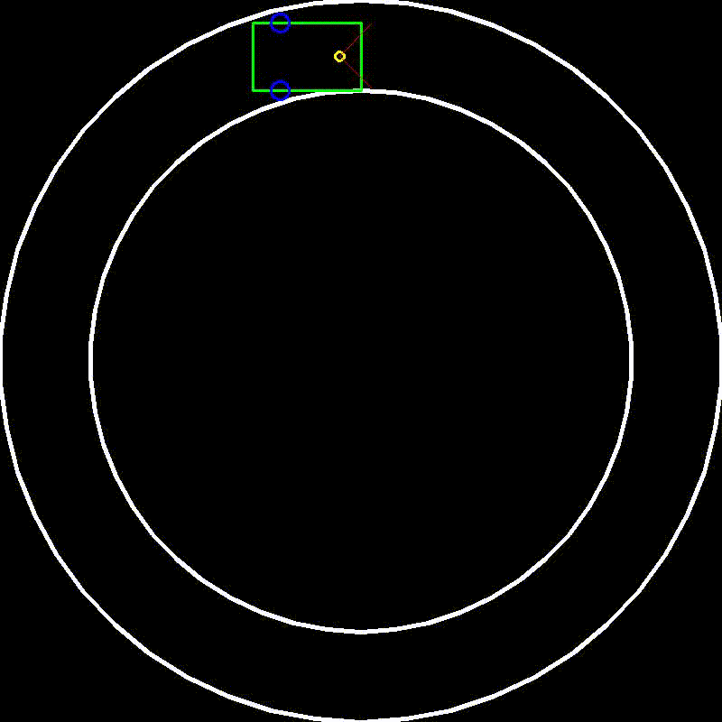

# RobSim
# Required python3 modules
- numpy
- opencv
## Install opencv with pip3 install opencv-python
## Install numpy with pip3 install numpy
# Key controls
 - 'q' Quits
 - 'w' Moves forward
 - 'a' Moves left
 - 'd' Moves right
 - 's' Moves backward
 - 'c' Clears screen
 - Left click for drawing lines
 - Right click for drawing walls
 - Middle click adds candle

 
 
